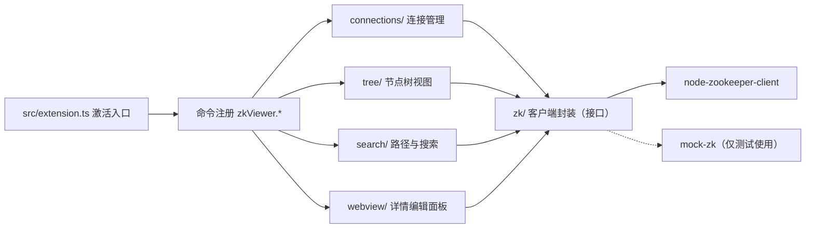

# 代码变更方案：zk-viewer-vscode ZooKeeper 可视化插件

**Plan ID:** zk-viewer-vscode-zookeeper-visual-client-20260803-231718
**创建时间:** 2026-08-03 23:17
**状态:** 等待审批
**风险等级:** 中

---

## 1. 基本信息与需求分析

### 需求来源

- `docs/REQUIREMENTS.md`（2026-08-03 定稿）

### 需求清单

| ID | 需求 | 说明 |
| --- | --- | --- |
| REQ-01 | 连接管理 | 多连接配置、digest 认证、断线重连、连接状态展示 |
| REQ-02 | 节点树可视化 | 树形展示、子节点懒加载、节点类型图标、右键菜单 |
| REQ-03 | 路径定位 | 输入完整路径直接跳转并展开目标节点 |
| REQ-04 | 名称搜索 | 按节点名称搜索，支持前缀、通配符与正则 |
| REQ-05 | 内容搜索（可选） | 按节点数据内容搜索，支持限定子树范围 |
| REQ-06 | JSON 展示 | 格式化、语法高亮、stat 信息；非 JSON / 二进制降级视图 |
| REQ-07 | JSON 编辑 | 实时语法校验、原子保存、版本冲突提示 |
| REQ-08 | 新增节点 | 支持持久 / 临时 / 顺序节点及可选初始数据 |
| REQ-09 | 删除节点 | 单个与递归删除，删除前二次确认 |
| REQ-10 | 编辑与刷新 | 修改节点数据并保存；刷新当前节点及子节点 |
| REQ-11 | 非功能需求 | 500+ 子节点不卡顿；凭据加密；TLS；VS Code >= 1.60（SecretStorage 门槛 1.57）、ZK 3.4+ |
| REQ-12 | 日志与命令面板 | 操作日志面板；全部核心操作支持命令面板入口 |

### 待决策问题

- [ ] Q1：ZooKeeper 客户端库选型（`node-zookeeper-client` 或 fork）
- [ ] Q2：是否在 CI 中引入真实 ZooKeeper 的 e2e 测试（依赖 Docker）
- [ ] Q3：首发版本是否需要中英双语界面（影响 M6 范围）
- [ ] Q4：是否已有 VS Code Marketplace 发布账号（影响发布方式）

---

## 2. 当前实现与差距

### 当前状态

仓库为初始化状态，仅包含：

- `README.md`（一行项目简介）、`LICENSE`（Apache 2.0）
- `AGENTS.md`（贡献者指南）、`docs/REQUIREMENTS.md`（需求说明）

无源码、无构建配置、无测试、无 CI。

### 差距分析

| 需求 | 当前 | 差距 |
| --- | --- | --- |
| 全部功能（REQ-01 ~ REQ-12） | 无任何代码 | 从零搭建 VS Code 扩展骨架，并分里程碑实现全部功能 |
| 构建与测试 | 无 | 需建立 TypeScript 编译、ESLint、Mocha 测试基础设施 |
| 自动化验证 | 无 | 需建立单元 / 集成测试与 CI 流水线 |

---

## 3. 目标方案与对比

### 总体方案

使用 TypeScript 开发 VS Code 扩展：侧边栏节点树采用 `TreeDataProvider`，详情与编辑面板采用 Webview，ZooKeeper 访问通过统一接口封装，测试时注入内存 Mock 客户端，凭据使用 VS Code `SecretStorage` 加密保存。

### 架构



### 关键决策

- **D1 客户端接口抽象：** 封装 `ZkClient` 接口，库实现可替换 → 原因：`node-zookeeper-client` 维护状态需在 M1 评估，接口隔离可低成本换库。
- **D2 TreeDataProvider + Webview：** 树视图用原生 `TreeDataProvider`（性能好），编辑用 Webview（交互丰富）→ 原因：VS Code 官方推荐组合，符合需求中的"轻量可视化"定位。
- **D3 凭据存 SecretStorage：** 连接密码存入 VS Code 加密存储 → 原因：复用系统密钥链 / DPAPI，避免明文落盘。
- **D4 内存 Mock 客户端：** 测试使用内存 znode 树的 Mock 实现 → 原因：单元测试无网络依赖、确定性高，CI 无需部署 ZooKeeper。
- **D5 乐观并发控制：** 编辑保存时携带 `stat.version` 调用 `setData` → 原因：防止多人 / 多端操作互相覆盖。
- **D6 懒加载与分页：** 子节点展开时才请求，大节点数据按需加载 → 原因：满足 500+ 子节点性能要求。

### 流程对比

```text
当前流程：无（仓库无代码）

目标流程：选择连接 → 连接（含认证）→ 树浏览（懒加载）→ 路径定位 / 搜索
          → 详情查看（JSON 格式化 + stat）→ 新增 / 编辑（版本校验）/ 删除（确认）
          → 操作日志记录
```

---

## 4. 影响范围与文件清单

### 文件清单（白名单，仅允许修改以下文件）

```text
✏️ 修改
  - AGENTS.md（补充 .code/change-plans 目录说明）

🆕 新增
  - CU-001  package.json（扩展清单、脚本、依赖）
  - CU-002  tsconfig.json、tsconfig.eslint.json
  - CU-003  .vscode/launch.json、.vscode/tasks.json
  - CU-004  eslint.config.mjs、.prettierrc、.gitignore
  - CU-005  src/extension.ts（激活入口与命令注册）
  - CU-006  src/connections/connection-store.ts（连接配置持久化）
  - CU-007  src/connections/secret-storage.ts（凭据加密存储）
  - CU-008  src/zk/zk-client.ts（ZkClient 接口与 node-zookeeper-client 封装）
  - CU-009  src/zk/mock-zk.ts（内存 Mock 实现，仅测试导入）
  - CU-010  src/tree/node-tree-provider.ts（TreeDataProvider）
  - CU-011  src/tree/node-model.ts（节点类型与图标映射）
  - CU-012  src/search/path-resolver.ts（路径定位）
  - CU-013  src/search/node-search.ts（名称 / 内容搜索）
  - CU-014  src/webview/node-detail-panel.ts（详情与编辑面板）
  - CU-015  src/webview/json-utils.ts（JSON 判定、格式化、校验）
  - CU-016  src/commands/node-commands.ts（新增 / 编辑 / 删除 / 刷新）
  - CU-017  src/log/activity-log.ts（操作日志）
  - CU-018  media/styles.css、media/detail.js（Webview 资源）
  - CU-019  test/unit/**（Mocha 单元测试）
  - CU-020  test/integration/**（@vscode/test-electron 集成测试）
  - CU-021  .github/workflows/ci.yml（三平台 CI）
  - CU-022  README.md（安装与使用说明）
```

### 影响范围

- **全部模块** - 影响程度：高（本项目为从零构建，所有模块均为新增）
- **既有文件** - 影响程度：低（仅 AGENTS.md 补充目录说明，README/LICENSE 不动）
- **对外影响** - 无（插件未发布，不破坏任何现有使用者）

---

## 5. 实施顺序

### M0 项目脚手架

**目标：** 建立可编译、可测试、可打包的 VS Code 扩展空骨架。

**变更单元：** CU-001、CU-002、CU-003、CU-004、CU-005、CU-019（最小冒烟）、CU-022（基础）

**验收标准：**

- [ ] AC-001 `npm ci` 成功，依赖解析无错误
- [ ] AC-002 `npm run compile` 退出码 0，无 TypeScript 类型错误
- [ ] AC-003 `npm run lint` 退出码 0，无 ESLint 错误
- [ ] AC-004 `npm run test:unit` 通过，至少 1 个扩展激活冒烟用例
- [ ] AC-005 `npm run test:integration` 通过：扩展在 Extension Development Host 中激活，`package.json` 贡献的命令均已注册
- [ ] AC-006 `vsce package --out dist` 成功生成 `dist/*.vsix`

**验证：** V-001、V-002、V-003、V-004、V-005

---

### M1 连接管理

**目标：** 实现多连接配置、凭据加密、连接 / 断开 / 重连与状态展示。

**变更单元：** CU-006、CU-007、CU-008、CU-009、CU-019

**验收标准：**

- [ ] AC-011 连接配置 CRUD 单元测试通过：保存、读取、删除往返一致，数据持久化到 `workspaceState`
- [ ] AC-012 SecretStorage 封装单元测试通过（Mock 存储）：set / get / delete 往返一致，明文不出现在配置文件中
- [ ] AC-013 连接状态机单元测试通过：`connecting → connected → disconnected`；失败路径进入 `disconnected` 并携带错误消息
- [ ] AC-014 digest 认证参数构造单元测试通过：生成的 `authInfo` 含 `digest:<user>:<digest>` 格式
- [ ] AC-015 集成测试通过：执行 `zkViewer.connect` 后状态显示 connected；执行 `zkViewer.disconnect` 后 Mock 客户端的 `close()` 被调用（断言）
- [ ] AC-016 断线重连单元测试通过：连接丢失后按配置重连，达到最大次数后停止并提示

**验证：** V-003、V-004

---

### M2 节点树可视化

**目标：** 实现侧边栏节点树、懒加载、节点类型图标与右键菜单。

**变更单元：** CU-010、CU-011、CU-018（样式基础）、CU-019

**验收标准：**

- [ ] AC-021 `getChildren` 单元测试通过：根路径返回一级节点；展开子节点时才请求该路径（断言 Mock 请求次数）
- [ ] AC-022 节点类型单元测试通过：依据 `ephemeralOwner` 与顺序标志，正确映射持久 / 持久顺序 / 临时 / 临时顺序四种图标
- [ ] AC-023 菜单贡献断言：`package.json` 中 `menus` 贡献了刷新、新增、编辑、删除、复制路径等命令
- [ ] AC-024 集成测试通过：连接 Mock 后树视图渲染根节点；执行 `zkViewer.refresh` 后树数据更新

**验证：** V-002、V-003、V-004

---

### M3 查询与搜索

**目标：** 实现路径定位、名称搜索与内容搜索。

**变更单元：** CU-012、CU-013、CU-019

**验收标准：**

- [ ] AC-031 路径解析单元测试通过：合法路径返回对应节点；非法路径（不存在 / 格式错误）返回明确错误
- [ ] AC-032 名称搜索单元测试通过：前缀模式返回全部匹配节点，结果按层级路径排序
- [ ] AC-033 通配符与正则搜索单元测试通过：`/app/*/config`、`^/svc-\d+` 等模式命中预期集合
- [ ] AC-034 内容搜索单元测试通过（Mock 数据）：命中指定文本的节点列表正确，限定子树范围生效
- [ ] AC-035 集成测试通过：执行 `zkViewer.search` 显示结果列表，点击结果后树视图展开并定位到对应节点

**验证：** V-003、V-004

---

### M4 JSON 展示与编辑

**目标：** 实现详情面板（stat + 数据）、JSON 格式化展示与带版本校验的编辑保存。

**变更单元：** CU-014、CU-015、CU-018、CU-019

**验收标准：**

- [ ] AC-041 JSON 判定单元测试通过：合法 JSON、非 JSON 文本、含 `\0` 的二进制数据分类正确
- [ ] AC-042 格式化单元测试通过：缩进正确、键顺序保持原序、非法 JSON 返回错误信息且不抛异常
- [ ] AC-043 Webview 消息协议单元测试通过：`loadData` 返回 stat 与数据；`saveData` 携带版本号调用 `setData`
- [ ] AC-044 版本冲突单元测试通过：`setData` 抛出 `BadVersion` 时面板显示冲突提示，数据不被覆盖
- [ ] AC-045 集成测试通过：打开节点详情面板显示 stat 全字段；编辑 JSON 保存后 Mock 数据更新

**验证：** V-003、V-004

---

### M5 节点操作

**目标：** 实现新增、编辑、删除（单个 / 递归）与刷新。

**变更单元：** CU-016、CU-019

**验收标准：**

- [ ] AC-051 新增节点单元测试通过：四种节点类型均创建成功；非法节点名被拒绝；可选初始数据生效
- [ ] AC-052 编辑节点单元测试通过：`setData` 调用参数（路径、数据、版本）与预期一致
- [ ] AC-053 删除节点单元测试通过：删除前触发确认，取消确认则不调用 `remove`
- [ ] AC-054 递归删除单元测试通过：先删子节点后删父节点（调用顺序断言）；不存在的路径返回明确错误
- [ ] AC-055 集成测试通过：创建 → 编辑 → 删除全流程执行后，树视图同步刷新且最终状态正确

**验证：** V-003、V-004

---

### M6 完善与发布

**目标：** 性能优化、TLS、日志面板、CI 全绿与打包发布。

**变更单元：** CU-017、CU-021、CU-022

**验收标准：**

- [ ] AC-061 性能测试通过（`npm run test:perf`）：Mock 500 子节点场景下懒加载只请求已展开节点，`getChildren` 单次耗时 < 500ms（超时断言）
- [ ] AC-062 TLS 单元测试通过：TLS 配置正确传递到客户端构造参数（Mock 断言）
- [ ] AC-063 日志单元测试通过：连接、增删改、保存、错误均写入日志面板
- [ ] AC-064 全量 CI 通过：ubuntu / windows / macOS 三平台 `compile + lint + test:unit + test:integration` 全绿
- [ ] AC-065 产物可安装：`code --install-extension dist/*.vsix` 成功且扩展可激活
- [ ] AC-066 README 完善：包含安装、连接配置、功能说明与截图（人工复核项，不作为自动化门槛）

**验证：** V-001、V-002、V-003、V-004、V-005、V-006、V-007

---

## 6. 测试、验证与完成

### 测试策略

- **单元测试：** Mocha，注入 Mock 客户端（CU-009），无网络依赖
- **集成测试：** `@vscode/test-electron` 启动 Extension Development Host 验证扩展行为
- **静态检查：** `tsc`（类型）、ESLint（规范）、Prettier（格式）
- **打包：** `vsce package` 生成可安装 `.vsix`
- **性能：** 专用 Mocha 用例断言懒加载行为与耗时上限

### 全局验证命令

| ID | 命令 | 期望结果 |
| --- | --- | --- |
| V-001 | `npm run compile` | 退出码 0，无类型错误 |
| V-002 | `npm run lint` | 退出码 0 |
| V-003 | `npm run test:unit` | 全部用例通过 |
| V-004 | `npm run test:integration` | 全部用例通过 |
| V-005 | `vsce package --out dist` | 生成 `dist/*.vsix` |
| V-006 | `npm run format:check` | 退出码 0 |
| V-007 | `npm run test:perf` | 性能断言通过 |
| V-008 | `npm run test:e2e`（可选，需 Docker 真实 ZK） | 全部用例通过 |

### 追溯矩阵

| 需求 | 验收标准 | 变更单元 | 验证 |
| --- | --- | --- | --- |
| REQ-01 | AC-011 ~ AC-016 | CU-006 ~ CU-009 | V-003、V-004 |
| REQ-02 | AC-021 ~ AC-024 | CU-010、CU-011 | V-002、V-003、V-004 |
| REQ-03、04、05 | AC-031 ~ AC-035 | CU-012、CU-013 | V-003、V-004 |
| REQ-06、07 | AC-041 ~ AC-045 | CU-014、CU-015 | V-003、V-004 |
| REQ-08、09、10 | AC-051 ~ AC-055 | CU-016 | V-003、V-004 |
| REQ-11、12 | AC-061 ~ AC-066 | CU-017、CU-021 | V-001 ~ V-007 |

### 完成定义（DoD）

- 当前里程碑全部验收标准通过
- V-001 ~ V-006 全绿（M6 起包含 V-007）
- 新增核心模块（connections / tree / search / webview / commands）单元测试覆盖率 >= 70%（c8 统计并报告）
- 每个里程碑独立提交并以 PR 合入 `main`

### 风险与回滚

**风险：**

- 🔴 **高：** `node-zookeeper-client` 维护停滞 → D1 接口抽象，M1 后评估换库，成本限于封装层
- 🔴 **高：** `node-zookeeper-client` 为原生模块，需与 Extension Host 的 Electron ABI 匹配 → 旧版 VS Code 可能需要 `electron-rebuild`；通过接口隔离 + 集成测试固定运行在最低支持版本 1.60 验证
- 🟡 **中：** 大数据量导致 UI 卡顿 → 懒加载 + 分页 + AC-061 性能测试把关
- 🟡 **中：** Extension Development Host 集成测试在 CI 不稳定 → Linux 使用 xvfb，锁定 VS Code 测试版本
- 🟢 **低：** 临时节点随会话断开消失 → UI 明确提示 + AC-016 重连测试覆盖

**回滚方案：**

```bash
# 每个里程碑以独立 PR 合入，回滚对应 PR 即可
git revert <milestone-merge-commit>
```

---

## 7. 执行契约与审批

**审批状态：** WAITING_FOR_APPROVAL

### 待处理事项

- [ ] Q1：确认 ZooKeeper 客户端库选型（`node-zookeeper-client` 或 fork）
- [ ] Q2：确认是否在 CI 引入真实 ZooKeeper 的 e2e（需 Docker）
- [ ] Q3：确认首发是否包含中英双语界面（影响 M6 范围）
- [ ] Q4：确认 VS Code Marketplace 发布账号与插件命名

### 审批通过后执行

```text
读取并执行以下代码变更方案：
.code/change-plans/zk-viewer-vscode-zookeeper-visual-client-20260803-231718.md

要求：
1. 按文件清单修改代码
2. 每步完成后运行对应验证命令
3. 发现问题立即停止并报告
4. 验证全部通过后报告完成
```

---

**方案结束**
