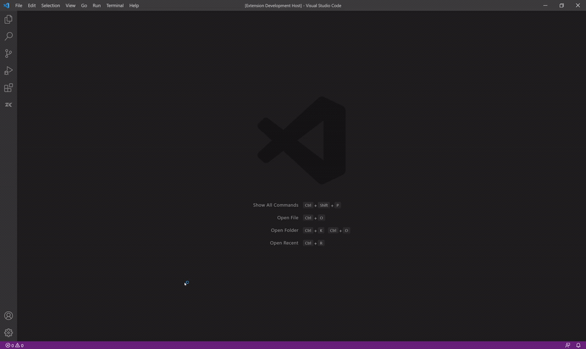

# ZooKeeper Viewer

在 VS Code 内直接浏览和管理 Apache ZooKeeper。无需额外部署 Web 控制台，即可完成多连接管理、节点搜索、JSON/TXT 查看与编辑、节点增删，以及子树导入导出。

> English summary is available in [English](#english).



The demo covers the main workflow: connect to ZooKeeper, browse and sort nodes, search by path, inspect and edit JSON data, and import/export node data.

## 为什么使用

- **轻量直达**：从 VS Code 活动栏进入，不切换开发环境
- **安全连接**：支持多地址、Chroot、digest 认证和 TLS；密码保存在 VS Code SecretStorage 中
- **高效浏览**：节点按需懒加载，可按名称、创建时间或更新时间排序
- **完整搜索**：支持精确路径、名称前缀、路径通配符、正则和节点内容搜索
- **谨慎编辑**：详情默认只读，保存使用 ZooKeeper 版本号校验，冲突时不会覆盖远端数据
- **便捷迁移**：单节点或完整子树可无损导出为 JSON，并可恢复到 ZooKeeper
- **中英文界面**：可跟随 VS Code，也可手动切换中文或 English

## 要求

- VS Code `1.60.0` 或更高版本
- Apache ZooKeeper `3.4` 或更高版本
- Windows、macOS 或 Linux

## 安装

在 VS Code 扩展视图中搜索 **ZooKeeper Viewer**，点击 **安装**；也可以打开 [Visual Studio Marketplace 页面](https://marketplace.visualstudio.com/items?itemName=BeWater.zk-viewer-vscode)。

也可以下载 VSIX 后执行：

```bash
code --install-extension zk-viewer-vscode.vsix
```

## 快速上手

1. 点击活动栏中的 ZooKeeper 图标。
2. 点击侧边栏标题栏的 **加号**，填写连接名称和服务器地址，例如 `localhost:2181`。
3. 点击 **连接**（插头图标）。
4. 展开节点树；双击节点打开详情，或右键执行新增、删除、复制路径、搜索和导出。
5. 点击标题栏的 **放大镜**，快速搜索或定位节点。

## 操作手册

### 连接管理

点击标题栏的 **加号**，或在命令面板中运行 `ZooKeeper: Add Connection...`。

| 字段 | 说明 | 示例 |
| --- | --- | --- |
| 连接名称 | 本地显示的别名 | `开发环境` |
| 主机列表 | 逗号分隔的 `host:port` | `zk1:2181,zk2:2181` |
| Chroot | 可选的根路径前缀 | `/app` |
| 用户名 / 密码 | 可选的 digest 认证凭据 | `admin` / `******` |
| 使用 TLS | 使用 `ssl://` 连接 | 开启 / 关闭 |

连接配置保存在 VS Code 工作区状态中；密码使用 VS Code SecretStorage 单独加密保存，不会写入普通配置或日志。通过标题栏的省略号菜单可编辑或删除连接，删除连接时也会清除对应密码。

网络抖动或会话超时后，扩展会自动尝试重连。可通过 `zkViewer.maxReconnectAttempts` 和 `zkViewer.reconnectDelayMs` 调整次数与间隔。

### 浏览与排序

- 展开节点时仅加载当前层级，不会一次读取整棵树。
- 节点图标区分持久、持久顺序、临时和临时顺序节点。
- 右键节点可新增、编辑、删除、复制路径、搜索子树、导出和刷新。
- 在标题栏省略号菜单中选择 `Sort Nodes...`，可按名称、创建时间、更新时间正序或倒序排列，也可保留服务器顺序。

### 搜索与定位

点击标题栏的 **放大镜**，或运行 `ZooKeeper: Search Nodes...`。

| 模式 | 匹配方式 | 示例 |
| --- | --- | --- |
| 精确路径 | 直接定位完整路径 | `/app/config` |
| 名称前缀 | 节点名称以关键字开头 | `config` |
| 路径通配符 | `*` / `?` 匹配路径 | `/app/*/config` |
| 路径正则 | 正则匹配完整路径 | `^/svc-\d+$` |
| 内容 | 节点数据包含关键字 | `role` |

搜索结果按路径排序。点击结果后，节点树会展开并定位到对应节点。内容搜索可限定子树范围，搜索过程中可按 Esc 取消。

默认最多遍历 500000 个节点；达到 `zkViewer.maxSearchNodes` 上限时，界面会提示结果可能不完整。将该设置设为 `0` 可取消数量限制。`zkViewer.maxNodeDataBytes` 用于限制内容搜索读取的数据大小，默认 `0` 表示不限制。

### 查看与编辑数据

1. 双击节点，或右键选择 `Open Details`。
2. 详情面板显示节点路径、stat 信息和数据内容。
3. JSON 数据默认格式化展示；可切换到 TXT 查看原始文本，并可控制换行。
4. 详情默认只读。点击 **Edit** 后才可修改。
5. JSON 模式保存时会紧凑序列化；TXT 模式按输入内容原样保存。
6. 保存时携带加载时的节点版本号。若其他客户端已修改节点，扩展会报告版本冲突且不会覆盖远端数据。

非 JSON 文本会自动切换为文本展示；二进制数据以十六进制只读展示。

### 新增与删除节点

右键父节点并选择 `Add Node...`。节点名不能包含 `/`，也不能是 `.` 或 `..`。

| 类型 | 行为 |
| --- | --- |
| 持久 | 会话断开后仍保留 |
| 持久顺序 | 自动追加递增序号并持久保留 |
| 临时 | 会话断开时由 ZooKeeper 删除 |
| 临时顺序 | 自动追加序号，会话断开时删除 |

删除节点前会要求确认。节点包含子节点时，可选择递归删除；扩展会先删除子节点，再删除父节点。

### 导入与导出

- `Export Node Data...`：导出当前节点。
- `Export Node and Descendant Data...`：导出当前节点及完整子树。
- 标题栏省略号菜单中的 `Import Node Data...`：读取标准导出 JSON 并恢复节点。
- `View Import Format`：查看只读格式说明并下载模板。

导出数据包含完整 `path`、`data` 和 `encoding`。文本使用 `utf8`，无法无损表示为 UTF-8 的数据使用 `base64`。

导入前可选择跳过或覆盖已存在节点。扩展会在写入前校验格式版本、路径范围、重复路径、Base64 数据和外部父节点；缺失节点按父级优先创建为持久节点。

### 语言

点击标题栏语言按钮，选择：

- 跟随 VS Code
- 中文
- English

切换后会立即更新菜单、通知、搜索、导入导出和已打开的详情面板。

## 隐私与安全

- 扩展不包含遥测或使用情况上报。
- ZooKeeper 数据只在 VS Code 与你配置的 ZooKeeper 服务器之间传输。
- digest 密码使用 VS Code SecretStorage 保存。
- 节点详情默认只读；修改和删除操作需要显式触发，删除包含确认步骤。

请仍遵循最小权限原则，为日常浏览使用只读或受限的 ZooKeeper 账号。

## 已知限制

- 二进制节点数据仅支持十六进制只读展示。
- 临时节点会按 ZooKeeper 语义在会话断开后消失。
- 超大集群的全树内容搜索可能耗时较长，建议从目标子树开始搜索。

## 支持与反馈

遇到问题请查看 [支持说明](SUPPORT.md)，或提交 [GitHub Issue](https://github.com/BeWaterMyFriend7/zk-viewer-vscode/issues)。

## 许可证

[Apache License 2.0](LICENSE)

## English

ZooKeeper Viewer is a lightweight Apache ZooKeeper client for VS Code. It supports multiple connections, digest authentication, TLS, lazy tree browsing, path and content search, safe JSON/TXT editing with version checks, node management, subtree import/export, and Chinese/English UI.

Open the ZooKeeper view from the Activity Bar, add a connection with the **+** button, connect, and expand the tree. Node details are read-only until you explicitly select **Edit**. Passwords are stored with VS Code SecretStorage, and the extension does not include telemetry.

Requirements: VS Code 1.60.0+, Apache ZooKeeper 3.4+, Windows/macOS/Linux.

For help, see [SUPPORT.md](SUPPORT.md) or open a [GitHub issue](https://github.com/BeWaterMyFriend7/zk-viewer-vscode/issues).
