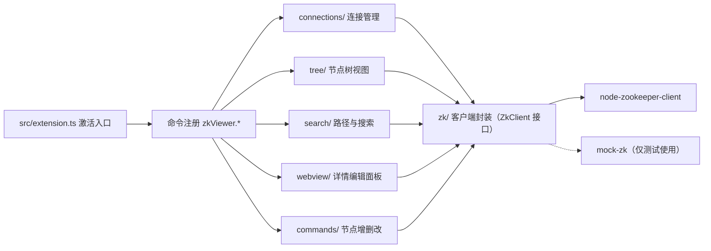

# zk-viewer-vscode 设计文档

**状态：** 已实施（2026-08-04）  
**关联文档：** [需求文档](REQUIREMENTS.md) | [贡献者指南](../AGENTS.md)

---

## 1. 概述

### 1.1 目标

在 VS Code 内提供轻量级 ZooKeeper 可视化客户端：节点树浏览、路径定位与搜索、JSON 展示与编辑、节点增删改。支持多连接配置、digest 认证、TLS 与断线重连。

### 1.2 非目标

- 不实现 ZooKeeper 管理面功能（四字命令、集群重配置）；
- 不做完整 ACL 管理界面（仅支持 digest 认证与节点 ACL 查看）。

### 1.3 需求来源

- `REQ-01` 连接管理：多连接、digest、重连、状态展示
- `REQ-02` 节点树：懒加载、类型图标、右键菜单
- `REQ-03` 路径定位；`REQ-04` 名称搜索；`REQ-05` 内容搜索
- `REQ-06` JSON 展示；`REQ-07` JSON 编辑（版本校验）
- `REQ-08` 新增节点；`REQ-09` 删除节点；`REQ-10` 编辑与刷新
- `REQ-11` 非功能：性能、安全、兼容（VS Code >= 1.60，三平台）
- `REQ-12` 操作日志与命令面板入口

---

## 2. 总体架构

### 2.1 架构图



### 2.2 目录结构

```text
src/
  extension.ts          # 激活入口、命令注册、测试 API 暴露
  connections/          # 连接配置存储、SecretStorage、连接管理器
  commands/             # 节点增删改与递归删除（纯逻辑，可单测）
  tree/                 # TreeDataProvider、节点模型、懒加载列表
  search/               # 路径解析、名称/内容搜索
  webview/              # 详情面板、JSON 工具、消息控制器
  log/                  # 操作日志（内存订阅模型）
  zk/                   # ZkClient 接口、原生封装、Mock 实现
media/                  # 活动栏图标、Webview 静态资源
test/unit|perf|integration/
```

---

## 3. 模块设计

### 3.1 连接管理（connections/）

- `ConnectionStore`：连接配置持久化到 `workspaceState`，密码单独存 `SecretStorage`，配置中永不出现明文；
- `ConnectionManager`：连接状态机 `closed → connecting → connected → disconnected → closed`，断线自动重连，达到 `maxReconnectAttempts` 后停止并暴露错误；
- `SecretStorageWrapper`：带命名空间前缀的密钥封装，便于单元测试注入 Fake；
- `buildZkConnectionString`：拼接 `hosts[+chroot]`，TLS 时前缀 `ssl://`。

### 3.2 节点树（tree/）

- `NodeTreeProvider`（TreeDataProvider）：根节点为 `/`，子节点按需展开；
- `listChildDescriptors`：仅请求当前层级的 `getChildren` + **并发** `getStat`（限流窗口 32）识别类型，满足懒加载，宽层级不再串行化；
- `treeSort`：子节点按名称升序 / 降序 / 保持服务器顺序（配置 `zkViewer.treeSort`，默认按名称升序）；
- `node-model`：由 `ephemeralOwner` 与顺序命名（`-\d{10}$`）推导四种节点类型，映射 Codicon。

**活动栏图标规范：** SVG 必须为单色（`currentColor`）、无背景色块、无渐变，由 VS Code 主题着色，否则在新版 VS Code（尤其 Windows）中不渲染。

### 3.3 查询搜索（search/）

- `path-resolver`：路径规范化（去重复斜杠 / 末尾斜杠）与存在性校验；
- `node-search`：**层级并行**遍历（每层节点按并发窗口批量请求，默认 16），支持前缀 / 通配符（`*`、`?`）/ 正则 / 内容四种模式，`maxNodes` 限制访问上限，结果按路径排序；
- 内容搜索先 `getStat` 预检：`dataLength == 0` 或超过 `maxDataBytes` 的节点直接跳过，避免下载空数据与超大节点。

### 3.4 详情面板（webview/）

- `json-utils`：数据分类（JSON / 文本 / 二进制含 `\0`），JSON 二空格格式化，二进制十六进制视图；
- `DetailPanelController`：vscode 无关的消息协议，`loadData → save → saved/error`，保存携带 `stat.version` 乐观锁，`BadVersion` 冲突不覆盖并返回错误；
- `NodeDetailPanel`：Webview 面板（CSP nonce + localResourceRoots），与控制器桥接；**默认只读**，必须点击「Edit」按钮才进入编辑模式（防误触），二进制数据始终只读。

### 3.5 节点操作（commands/）

- `validateNodeName`：拒绝空名、`/`、`.`、`..`；
- `deleteNodeRecursively`：显式栈做叶子优先递归删除，避免深层树栈溢出；
- 删除命令支持二次确认（模态框）与「递归删除」选项，取消则不调用客户端。

### 3.6 客户端封装（zk/）

- `ZkClient` 接口：`connect / close / getChildren / getData / getStat / create / setData / remove / exists / onStateChange`；
- `NodeZkClient`：懒加载原生模块（`require` 延迟到真实连接），错误码映射为 `ZkError`（`NO_NODE / NODE_EXISTS / NOT_EMPTY / BAD_VERSION / NO_AUTH`）；
- `MockZkClient`：内存 znode 树，含请求日志（`childrenRequestLog`、`removalLog`）供测试断言，实现完整的四种创建模式与乐观锁语义。

---

## 4. 关键设计决策

| 决策 | 内容 | 原因 |
| --- | --- | --- |
| D1 接口抽象 | `ZkClient` 接口隔离原生库 | `node-zookeeper-client` 维护状态存疑，可低成本换库 |
| D2 视图组合 | TreeDataProvider + Webview | 官方推荐组合，树性能好、编辑交互丰富 |
| D3 凭据加密 | VS Code SecretStorage | 复用系统密钥链，避免明文落盘 |
| D4 Mock 测试 | 内存 znode 树 | 单元测试无网络依赖、确定性高，CI 无需部署 ZooKeeper |
| D5 乐观并发 | `setData(path, data, version)` | 防止多端操作互相覆盖 |
| D6 懒加载分页 | 展开时才请求子节点 | 满足 500+ 子节点性能要求 |
| D7 向下兼容 | `engines.vscode ^1.60`、`@types/vscode 1.60.0` 锁定、ES2021、显式 `activationEvents` | SecretStorage 门槛 1.57；类型面锁定防止误用新版 API；1.60 必须显式声明激活事件 |
| D8 测试隔离 | 集成测试通过 `globalThis.__zkViewerTestApi` 获取测试句柄 | VS Code 1.60 的 `extension.exports` 不可靠 |
| D9 图标规范 | 活动栏 SVG 单色 `currentColor`、无背景色块 | 遵循 VS Code 视图容器图标规范，保证深/浅主题均可见 |
| D10 并发与排序 | 树与搜索请求按批次并发（树 32 / 搜索 16），子节点按名称排序可配置 | 串行网络往返是大数据量下卡顿主因；排序便于人工查找 |

---

## 5. 数据与消息协议

### 5.1 Webview 消息

| 消息 | 方向 | 载荷 |
| --- | --- | --- |
| `loadData` | 扩展 → Webview | `{ path, stat, dataText, kind, editable }` |
| `save` | Webview → 扩展 | `{ type, path, text, version }` |
| `saved` | 扩展 → Webview | `{ type, path }` |
| `error` | 扩展 → Webview | `{ type, message, code? }` |

### 5.2 连接串与认证

- 连接串：`hosts[+chroot]`，TLS 前缀 `ssl://`；
- digest 认证：`addAuthInfo('digest', Buffer.from('user:password'))`，密码来自 SecretStorage，不进入日志。

---

## 6. 兼容性设计

- **VS Code**：最低 1.60（依赖 `SecretStorage` 1.57 API）；`@types/vscode` 精确锁定 1.60.0 防止类型漂移；
- **运行时**：TypeScript 编译目标 ES2021，兼容旧 Extension Host 的 Node 16；
- **激活**：显式声明全部 `activationEvents`（1.60 无自动生成）；
- **三平台**：CI 矩阵 ubuntu / windows / macos，集成测试固定运行于 VS Code 1.60.0；Linux 用 `xvfb-run` 无头运行；
- **原生模块**：`node-zookeeper-client` 需与 Extension Host 的 Electron ABI 匹配，必要时 `electron-rebuild`（已知限制）。

---

## 7. 测试与质量策略

### 7.1 测试分层

- **单元测试**（Mocha + Mock，无网络）：连接状态机、配置/密钥往返、搜索匹配、JSON 分类、消息协议、递归删除顺序、TLS 连接串；
- **性能测试**：500 子节点懒加载耗时 < 500ms，且只请求展开层级；500 节点内容搜索 < 2s；
- **集成测试**（`@vscode/test-electron`，Mock 模式）：扩展激活、命令注册、菜单贡献、连接/树/搜索/面板/节点操作全流程。

### 7.2 质量门槛

- `compile`、`lint`、`format:check` 全绿；
- 核心模块语句覆盖率 >= 70%（当前 79.7%）；
- VSIX 可安装：`code --install-extension dist/zk-viewer-vscode.vsix`。

### 7.3 验证命令

```bash
npm run compile && npm run lint && npm run format:check
npm run test:unit        # 单元测试
npm run test:perf        # 性能断言
npm run test:integration # VS Code 1.60.0 集成测试
npm run test:unit:cov    # 覆盖率报告
npm run package          # 打包 dist/zk-viewer-vscode.vsix
```

---

## 8. 里程碑与验收

| 里程碑 | 内容 | 验收（自动执行） |
| --- | --- | --- |
| M0 脚手架 | 构建 / 测试 / 打包基础设施 | compile、lint、unit、integration(1.60)、vsix 全绿 |
| M1 连接管理 | 多连接、SecretStorage、重连、Mock | 状态机 / 配置 CRUD / 认证参数 / 重连用例通过 |
| M2 节点树 | 懒加载、类型图标、右键菜单 | 请求次数断言、类型映射、菜单贡献断言 |
| M3 查询搜索 | 路径定位、前缀/通配符/正则/内容 | 命中集断言、搜索+reveal 集成通过 |
| M4 JSON 面板 | 格式化展示、版本校验保存 | JSON 分类、BadVersion 不覆盖、保存流程通过 |
| M5 节点操作 | 增 / 改 / 删（递归）/ 刷新 | 删除顺序、取消确认、非法名拒绝、全流程集成 |
| M6 完善发布 | 日志、性能、TLS、CI、README、打包 | perf <500ms、覆盖率 ≥70%、三平台 CI、vsix 可安装 |

---

## 9. 风险与回滚

**风险：**

- 🔴 高：`node-zookeeper-client` 维护停滞 / ABI 不匹配 → D1 接口隔离，必要时换库，成本限于封装层；
- 🟡 中：大数据量卡顿 → 懒加载 + `maxNodes` 限流 + 性能测试把关；
- 🟡 中：Extension Host 集成测试在 CI 不稳定 → Linux xvfb + 锁定 VS Code 测试版本；
- 🟢 低：临时节点随会话断开消失 → UI 明确提示 + 重连测试覆盖。

**回滚：**

```bash
git revert <milestone-merge-commit>
```
