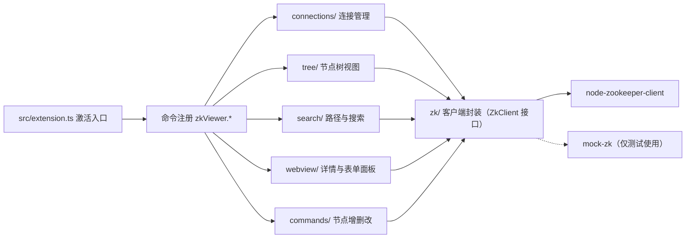

# zk-viewer-vscode 设计文档

**状态：** 已实施（2026-08-04）  
**关联文档：** [需求文档](REQUIREMENTS.md) | [贡献者指南](../AGENTS.md)

---

## 1. 概述

### 1.1 目标

在 VS Code 内提供轻量级 ZooKeeper 可视化客户端：节点树浏览、路径定位与搜索、JSON 展示与编辑、节点增删改。支持多连接配置、digest 认证、TLS 与断线重连。

### 1.2 非目标

- 不实现 ZooKeeper 管理面功能（四字命令、集群重配置）；
- 不做完整 ACL 管理界面（仅支持 digest 认证与节点 ACL 查看）。

### 1.3 需求来源

- `REQ-01` 连接管理：多连接、digest、重连、状态展示
- `REQ-02` 节点树：懒加载、类型图标、右键菜单
- `REQ-03` 路径定位；`REQ-04` 名称搜索；`REQ-05` 内容搜索
- `REQ-06` JSON 展示；`REQ-07` JSON 编辑（版本校验）
- `REQ-08` 新增节点；`REQ-09` 删除节点；`REQ-10` 编辑与刷新
- `REQ-11` 非功能：性能、安全、兼容（VS Code >= 1.60，三平台）
- `REQ-12` 操作日志与命令面板入口

---

## 2. 总体架构

### 2.1 架构图



### 2.2 目录结构

```text
src/
  extension.ts          # 激活入口、命令注册、测试 API 暴露
  connections/          # 连接配置存储、SecretStorage、连接管理器
  commands/             # 节点增删改、导入导出与递归删除（纯逻辑，可单测）
  i18n/                 # 扩展菜单、命令、通知与 Webview 共用的运行时中英文消息
  tree/                 # TreeDataProvider、节点模型、懒加载列表
  search/               # 路径解析、名称/内容搜索
  webview/              # 详情面板、连接/新增节点表单、JSON 工具、消息控制器
  log/                  # 操作日志（内存订阅模型）
  zk/                   # ZkClient 接口、原生封装、Mock 实现
media/                  # 活动栏图标、Webview 静态资源（含共用 data-editor、连接/新增节点表单脚本）
test/unit|perf|integration/
```

---

## 3. 模块设计

### 3.1 连接管理（connections/）

- `ConnectionStore`：连接配置持久化到 `workspaceState`，密码单独存 `SecretStorage`，配置中永不出现明文；
- `SecretStorageWrapper`：带命名空间前缀的密钥封装，便于单元测试注入 Fake；
- `ConnectionManager`：连接状态机 `closed → connecting → connected → disconnected → session-expired → closed`。网络抖动后被判定为「瞬时断连」，由底层库在**观察窗口**（时长 ≈ `maxReconnectAttempts × reconnectDelayMs`）内复用当前会话自动恢复，恢复后状态回到 connected，临时节点不丢失；只有会话真正过期（`session-expired`）、认证失败或窗口超时才关闭底层连接并停止后台重连，等待手动重新连接。手动 `disconnect()` 随时可取消观察窗口。
- `buildZkConnectionString`：拼接 `hosts[+chroot]`，TLS 时前缀 `ssl://`；连接表单的 **Test Connection** 通过注入的 `testConnection(config, password)` 依赖发起一次真实连接（成功后即关闭），用于保存前校验连通性。

### 3.2 节点树（tree/）

- `NodeTreeProvider`（TreeDataProvider）：根节点为 `/`，子节点按需展开；
- `listChildDescriptors`：仅请求当前层级的 `getChildren` + **并发** `getStat`（限流窗口 32）识别类型，满足懒加载，宽层级不再串行化；
- `treeSort`：子节点支持按名称、创建时间（`ctime`）、更新时间（`mtime`）各升/降序，以及服务器顺序（配置 `zkViewer.treeSort`，默认名称升序；侧边栏菜单「Sort Nodes...」可交互切换）；
- `node-model`：由 `ephemeralOwner`（将 8 字节零值规整为 `0x0`，可用 `isZeroId` 判断）与顺序命名（`-\d{10}$`）推导四种节点类型；`iconForType(type, isLeaf)` 为普通持久节点按是否有子节点映射文件夹 / 文件图标，持久顺序、临时、临时顺序保留专属 Codicon。

**活动栏图标规范：** SVG 必须为单色（`currentColor`）、无背景色块、无渐变，由 VS Code 主题着色，否则在新版 VS Code（尤其 Windows）中不渲染。

### 3.3 查询搜索（search/）

- `path-resolver`：路径规范化（去重复斜杠 / 末尾斜杠）与存在性校验；
- `node-search`：使用 `walkTree` **全局并发池**遍历（默认并发 16，worker 空闲即取下一个节点，深树与宽树均不被层间串行拖慢），支持精确路径 / 前缀 / 通配符（`*`、`?`）/ 正则 / 内容五种模式，`maxNodes` 限制访问上限，结果按路径排序；精确路径模式为直接查找（规范化路径 + `exists`），不遍历全树；
- 内容搜索**两阶段**：先高并发 `getStat` 预检（跳过空节点，`maxDataBytes > 0` 时跳过超大节点并计数），命中候选再以低并发窗口下载数据匹配——保证完整性的同时避免无谓的大块数据传输；
- `SearchOutcome`：`{ results, truncated, visitedNodes, maxNodes, oversizedSkipped, cancelled }`；`truncated` 标记遍历触及上限（默认 500000，0 = 无限制），`oversizedSkipped` 提示被跳过的超大节点数，`cancelled` 标记用户取消；
- **完整性优先**：`maxNodeDataBytes` 默认 0（不过滤），`maxSearchNodes` 默认 500000（可设 0 无限制），搜索结果以完整为第一目标，速度优化不牺牲完整性；
- **子树搜索**：`zkViewer.searchSubtree` 命令（右键菜单）以节点路径为搜索根，遍历范围缩小后速度与完整性兼得。

### 3.4 详情面板（webview/）

- `json-utils`：数据分类（JSON / 文本 / 二进制含 `\0`），JSON 二空格格式化与安全紧凑化，二进制十六进制视图；
- `DetailPanelController`：vscode 无关的消息协议，`loadData → save → saved/error`，保存携带 `stat.version` 乐观锁，`BadVersion` 冲突不覆盖并返回错误；保存前经 `nodeExists` 预检，删除 / 冲突错误通过 `notifyError` 弹出 VS Code 通知；打开节点时注册一次性数据 watch（`watchNode`），收到删除事件即报错并回调 `onNodeDeleted` 关闭面板，其他事件后自动重新武装以持续监测；
- `NodeDetailPanel`：Webview 面板（CSP nonce + localResourceRoots），与控制器桥接；原始数据与展示文本分离，支持 JSON / TXT 模式、换行开关与一键紧凑化，JSON 模式保存前紧凑序列化，TXT 模式原样保存；**默认只读**，必须点击「Edit」按钮才进入编辑模式（防误触），二进制数据始终只读；面板销毁时调用 `controller.dispose()` 停止响应陈旧 watch 事件。
- `data-editor.js`（`window.zkDataEditor.create(options)`）：**共用数据编辑器**，将数据区的 JSON 紧凑 / 格式化、JSON / TXT 切换、换行开关、一键压缩与草稿捕获抽为无 VS Code 依赖的前端模块；详情面板与新增节点表单通过既定 DOM id（`data`、`display-json`、`display-text`、`toggle-wrap`、`compact-json`、`status`）复用同一套展示与编辑逻辑。

### 3.5 节点操作（commands/）

- `NodeCreatePanel`：**新增节点表单** Webview，字段为只读父路径、节点名、类型下拉与数据区（复用 `data-editor.js`）；保存时经 `validateNodeName` 校验后调用 `client.create(fullPath, data, mode)`；交互式入口（无 `options`）打开表单，程序化入口（命令带 `options.name/mode/data`）走直接创建路径以兼容测试与命令。
- `validateNodeName`：拒绝空名、`/`、`.`、`..`；
- `collectNodeDataExport`：使用显式栈遍历节点，单节点模式只读取当前路径，子树模式读取全部后代；导出项包含完整路径，数据按 UTF-8 / Base64 自适应编码以保证无损；
- `parseNodeDataImport`：严格校验导出格式版本、固定字段、规范路径、根路径范围、重复项与 Base64 编码，拒绝未知字段并解码为无损 Buffer；
- `importNodeData`：写入前预检文档外部父节点，随后按路径深度父级优先创建；已存在节点按用户选择覆盖（版本校验）或跳过；
- `createImportTemplateDocument`：返回标准 `NodeDataExport` 示例；只读面板、模板下载与真实导出统一调用 `serializeNodeDataExport`，不存在模板专用结构或自定义字段映射；
- `deleteNodeRecursively`：显式栈做叶子优先递归删除，避免深层树栈溢出；
- 删除命令支持二次确认（模态框）与「递归删除」选项，取消则不调用客户端。

导入入口仅贡献到 `view/title` 的省略号菜单，排序为 `Sort Nodes...` 之后并保持始终可见；未连接时由命令处理器提示先连接。节点右键菜单只保留节点级导出。其下提供 `View Import Format`，打开没有 `textarea` 或 `contenteditable` 的只读 Webview，并可下载标准模板。

`zkViewer.uiLanguage` 支持 `auto / zh-cn / en`，通过 `zkViewer.setLanguage` 全局持久化；`auto` 跟随 `vscode.env.language`。扩展将解析后的语言写入 `zkViewer:uiLanguage` 上下文键，使标题栏、节点菜单和命令面板只显示对应语言的命令别名；连接与节点操作、搜索、进度、通知、导入导出和模板面板由 `i18n/import-export-messages` 使用同一解析结果。节点详情 Webview 接收同一消息字典，并通过 `languageChanged` 消息即时更新已打开面板，不重建编辑状态。

### 3.6 客户端封装（zk/）

- `ZkClient` 接口：`connect / close / getChildren / getData / getStat / watchData / create / setData / remove / exists / onStateChange`；`watchData` 为一次性数据 watch（节点被修改或删除时触发），由调用方决定是否重新注册；
- `NodeZkClient`：懒加载原生模块（`require` 延迟到真实连接），错误码映射为 `ZkError`（`NO_NODE / NODE_EXISTS / NOT_EMPTY / BAD_VERSION / NO_AUTH`）；
- `MockZkClient`：内存 znode 树，含请求日志（`childrenRequestLog`、`removalLog`）供测试断言，实现完整的四种创建模式、乐观锁语义与一次性数据 watch（`setData` 触发 `changed`、`remove` 触发 `deleted`）。

---

## 4. 关键设计决策

| 决策 | 内容 | 原因 |
| --- | --- | --- |
| D1 接口抽象 | `ZkClient` 接口隔离原生库 | `node-zookeeper-client` 维护状态存疑，可低成本换库 |
| D2 视图组合 | TreeDataProvider + Webview | 官方推荐组合，树性能好、编辑交互丰富 |
| D3 凭据加密 | VS Code SecretStorage | 复用系统密钥链，避免明文落盘 |
| D4 Mock 测试 | 内存 znode 树 | 单元测试无网络依赖、确定性高，CI 无需部署 ZooKeeper |
| D5 乐观并发 | `setData(path, data, version)` | 防止多端操作互相覆盖 |
| D6 懒加载分页 | 展开时才请求子节点 | 满足 500+ 子节点性能要求 |
| D7 向下兼容 | `engines.vscode ^1.60`、`@types/vscode 1.60.0` 锁定、ES2021、显式 `activationEvents` | SecretStorage 门槛 1.57；类型面锁定防止误用新版 API；1.60 必须显式声明激活事件 |
| D8 测试隔离 | 集成测试通过 `globalThis.__zkViewerTestApi` 获取测试句柄 | VS Code 1.60 的 `extension.exports` 不可靠 |
| D9 图标规范 | 活动栏 SVG 单色 `currentColor`、无背景色块 | 遵循 VS Code 视图容器图标规范，保证深/浅主题均可见 |
| D10 并发与排序 | 树子节点类型查询按批次并发（32）；子节点可按名称 / 创建时间 / 更新时间排序（stat 已在并发获取类型时带回，无需额外请求） | 串行网络往返是大数据量下卡顿主因；排序便于人工查找 |
| D11 全局并发游走 | `walkTree` 固定 worker 池 + 共享队列，替代层级批次 | 慢节点不再拖累同层，深树不再逐层串行 |
| D12 完整性优先 | `maxNodeDataBytes` 默认 0（不过滤），`maxSearchNodes` 默认 500000（0 = 无限制），截断 / 跳过均明确提示 | 搜索以"结果全"为第一目标，速度优化不牺牲完整性 |

---

## 5. 数据与消息协议

### 5.1 Webview 消息

| 消息 | 方向 | 载荷 |
| --- | --- | --- |
| `loadData` | 扩展 → Webview | `{ path, stat, dataText, kind, editable }` |
| `save` | Webview → 扩展 | `{ type, path, text, version }` |
| `saved` | 扩展 → Webview | `{ type, path }` |
| `error` | 扩展 → Webview | `{ type, message, code? }` |
| `save`（连接表单） | Webview → 扩展 | `{ type, state, newPassword? }` |
| `test`（连接表单） | Webview → 扩展 | `{ type, state, newPassword? }` |
| `testResult` | 扩展 → Webview | `{ type, ok, message }` |
| `create`（新增节点） | Webview → 扩展 | `{ type, name, mode, data }` |
| `nodeCreateError` | 扩展 → Webview | `{ type, message }` |

### 5.2 连接串与认证

- 连接串：`hosts[+chroot]`，TLS 前缀 `ssl://`；
- digest 认证：`addAuthInfo('digest', Buffer.from('user:password'))`，密码来自 SecretStorage，不进入日志。

---

## 6. 兼容性设计

- **VS Code**：最低 1.60（依赖 `SecretStorage` 1.57 API）；`@types/vscode` 精确锁定 1.60.0 防止类型漂移；
- **运行时**：TypeScript 编译目标 ES2021，兼容旧 Extension Host 的 Node 16；
- **激活**：显式声明全部 `activationEvents`（1.60 无自动生成）；
- **三平台**：CI 矩阵 ubuntu / windows / macos，集成测试固定运行于 VS Code 1.60.0；Linux 用 `xvfb-run` 无头运行；
- **原生模块**：`node-zookeeper-client` 需与 Extension Host 的 Electron ABI 匹配，必要时 `electron-rebuild`（已知限制）。

---

## 7. 测试与质量策略

### 7.1 测试分层

- **单元测试**（Mocha + Mock，无网络）：连接状态机、配置/密钥往返、搜索匹配、JSON 分类、消息协议、导入导出、递归删除顺序、TLS 连接串；
- **性能测试**：500 子节点懒加载耗时 < 500ms，且只请求展开层级；500 节点内容搜索 < 2s；
- **集成测试**（`@vscode/test-electron`，Mock 模式）：扩展激活、命令注册、菜单贡献、连接/树/搜索/面板/节点操作全流程。

### 7.2 质量门槛

- `compile`、`lint`、`format:check` 全绿；
- 核心模块语句覆盖率 >= 70%（当前 79.7%）；
- VSIX 可安装：`code --install-extension dist/zk-viewer-vscode.vsix`。

### 7.3 验证命令

```bash
npm run compile && npm run lint && npm run format:check
npm run test:unit        # 单元测试
npm run test:perf        # 性能断言
npm run test:integration # VS Code 1.60.0 集成测试
npm run test:unit:cov    # 覆盖率报告
npm run package          # 打包 dist/zk-viewer-vscode.vsix
```

---

## 8. 里程碑与验收

| 里程碑 | 内容 | 验收（自动执行） |
| --- | --- | --- |
| M0 脚手架 | 构建 / 测试 / 打包基础设施 | compile、lint、unit、integration(1.60)、vsix 全绿 |
| M1 连接管理 | 多连接、SecretStorage、重连、Mock | 状态机 / 配置 CRUD / 认证参数 / 重连用例通过 |
| M2 节点树 | 懒加载、类型图标、右键菜单、多方式排序 | 请求次数断言、类型映射、菜单贡献断言、排序断言 |
| M3 查询搜索 | 路径定位、前缀/通配符/正则/内容 | 命中集断言、搜索+reveal 集成通过 |
| M4 JSON 面板 | 格式化展示、版本校验保存 | JSON 分类、BadVersion 不覆盖、保存流程通过 |
| M5 节点操作 | 增 / 改 / 删（递归）/ 刷新 | 删除顺序、取消确认、非法名拒绝、全流程集成 |
| M6 完善发布 | 日志、性能、TLS、CI、README、打包 | perf <500ms、覆盖率 ≥70%、三平台 CI、vsix 可安装 |

---

## 9. 风险与回滚

**风险：**

- 🔴 高：`node-zookeeper-client` 维护停滞 / ABI 不匹配 → D1 接口隔离，必要时换库，成本限于封装层；
- 🟡 中：大数据量卡顿 → 懒加载 + `maxNodes` 限流 + 性能测试把关；
- 🟡 中：Extension Host 集成测试在 CI 不稳定 → Linux xvfb + 锁定 VS Code 测试版本；
- 🟢 低：临时节点随会话断开消失 → UI 明确提示 + 重连测试覆盖。

**回滚：**

```bash
git revert <milestone-merge-commit>
```
